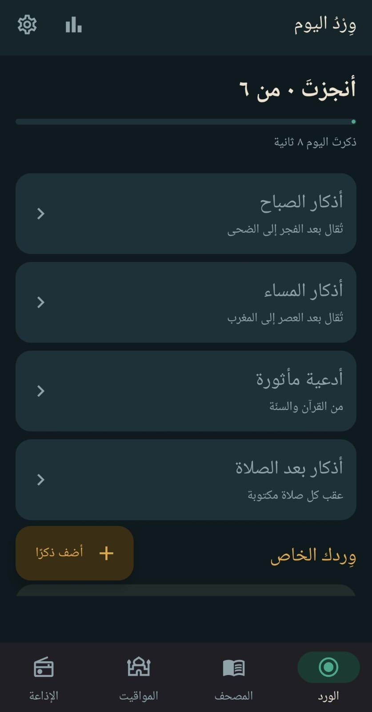
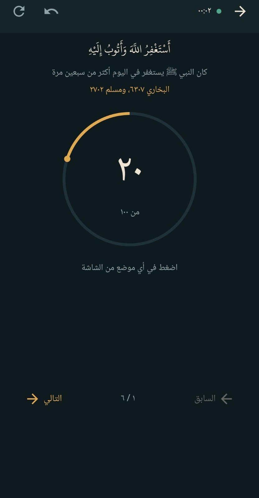
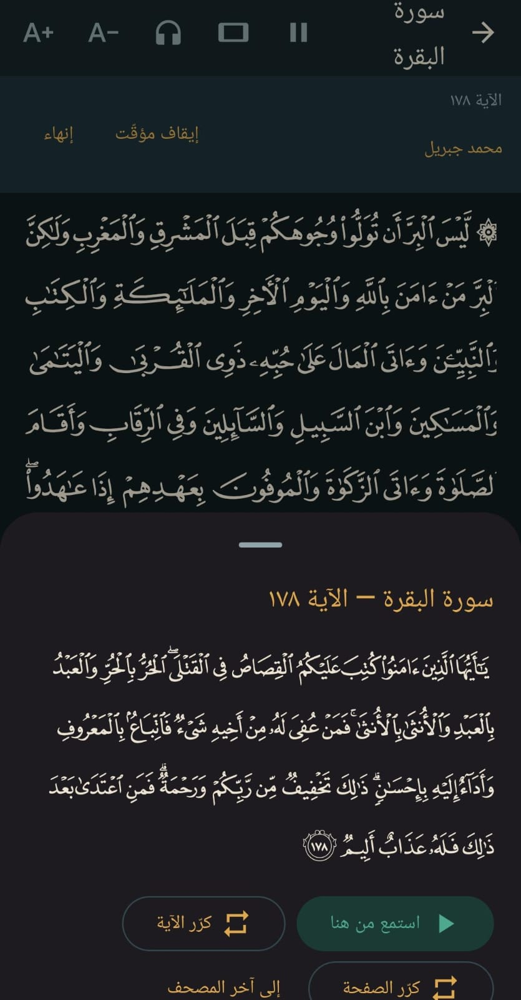
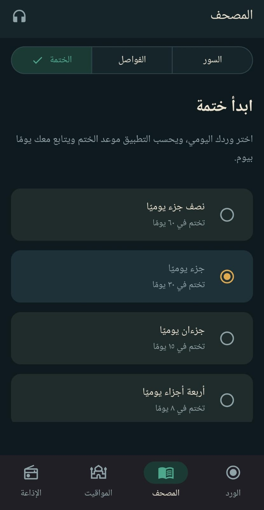
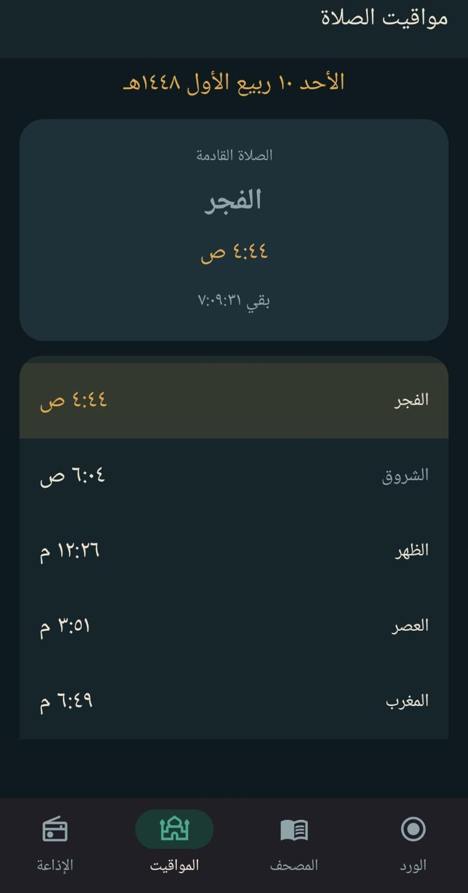
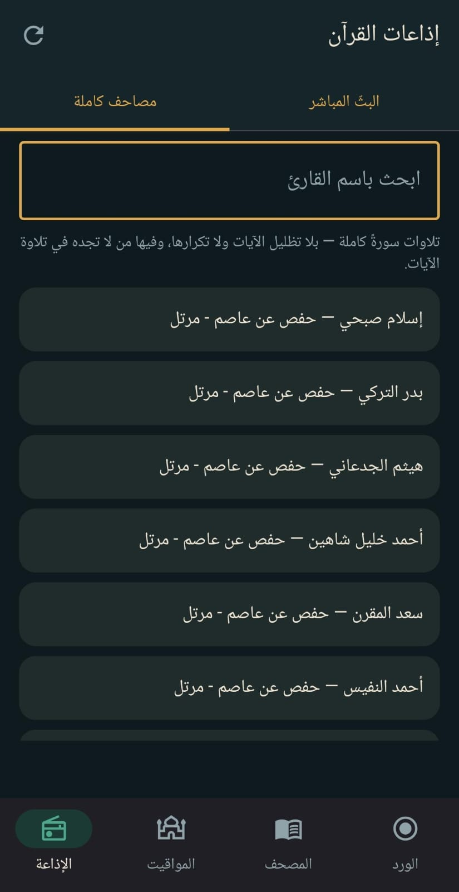

# هٰذَا ذِكْرٌ — تطبيق أندرويد للذكر والقرآن والمواقيت

تطبيق أندرويد إسلامي يجمع الذكر والقرآن والصلاة في مكان واحد، ويعمل دون إنترنت، بلا إعلانات ولا حسابات ولا تتبّع.

- **الذكر:** عدّاد بهدف لكل ذكر، يعدّ بأزرار الصوت والشاشة مطفأة، مع أذكار الصباح والمساء وما بعد الصلاة والأدعية المأثورة من «حصن المسلم» مع تخريج كل ذكر، وأدعية العمرة والطواف والسعي مع عدّاد الأشواط.
- **المصحف:** مصحف المدينة مطابق للمطبوع سطرًا بسطر، بقراءة متصلة بين السور، مع التفسير الميسّر والفواصل وخطة للختمة.
- **التلاوة:** أكثر من أربعين قارئًا مع تظليل الآية المتلوّة، وتكرار الآية أو الصفحة للحفظ، وتنزيل السور للاستماع دون إنترنت، وإذاعات القرآن.
- **الصلاة:** مواقيت تُحسب على الجهاز بعشر طرق، والأذان كاملًا مع تنبيه قبله، والتاريخ الهجري، واتجاه القبلة.

مكتوب بلغة Kotlin وواجهة Jetpack Compose، ويحفظ بياناته في Room وDataStore. الواجهة عربية بالكامل ومن اليمين إلى اليسار.

## صور من التطبيق

<table>
  <tr>
    <td align="center"><br>ورد اليوم</td>
    <td align="center"><br>عدّاد الذكر</td>
    <td align="center"><br>المصحف والتفسير والتلاوة</td>
  </tr>
  <tr>
    <td align="center"><br>خطة الختمة</td>
    <td align="center"><br>مواقيت الصلاة</td>
    <td align="center"><br>إذاعات القرآن</td>
  </tr>
</table>

---

## المزايا بالتفصيل

### الورد والعدّاد

- **عدّ تصاعدي أو تنازلي** لكل ذكر على حدة، والشاشة كلها منطقة ضغط.
- **العدّ بأزرار الصوت** دون النظر إلى الشاشة، كما تُستعمل السبحة.
- **اهتزاز خفيف** مع كل عدّة، و**اهتزاز مميّز** عند إتمام الذكر.
- **حلقة خرز** تُظهر موضعك من الذكر، و**تراجع** عن آخر عدّة إن أخطأت.
- **الانتقال تلقائيًا** إلى الذكر التالي عند إتمام الحالي.
- **يبدأ اليوم عند الفجر** لا عند منتصف الليل، والساعة قابلة للضبط.
- **الحفظ فوري:** كل ضغطة تُحفظ، فلا يضيع شيء إن أُغلق التطبيق.
- **إحصاءات** لآخر ثلاثين يومًا، وسلسلة مواظبة، ومؤقّت يقيس زمن الذكر الفعلي ويتوقّف بعد دقيقتين بلا ضغط.
- **تذكير** بإكمال الورد يعرض في الإشعار نصّ أول ذكر لم يكتمل، مع زرّ «ذكّرني بعد ساعة».

### الأوراد الجاهزة

أزرار في أعلى شاشة الورد تفتح أورادًا كاملة، كل ذكر فيها بطاقة تُضغط حتى يتمّ عدده:

| الورد | ما فيه |
|---|---|
| أذكار الصباح | خمسة وعشرون ذكرًا بترتيب «حصن المسلم» |
| أذكار المساء | الأذكار نفسها بصيغها المسائية («أمسينا» بدل «أصبحنا») |
| أذكار بعد الصلاة | ويذكّر بها إشعار بعد كل أذان بعشر دقائق |
| أدعية مأثورة | من القرآن والسنّة |
| أدعية العمرة | نية الإحرام، والتلبية، ودخول المسجد الحرام |
| أدعية الطواف | مع **عدّاد الأشواط السبعة** |
| أدعية السعي | مع **عدّاد الأشواط** واتجاه كل شوط (من الصفا إلى المروة أو العكس) |

يُحفظ تقدّمك في الورد لليوم نفسه، ويبدأ من جديد في اليوم التالي. أما عدّاد الأشواط فيُحفظ اثنتي عشرة ساعة، فلا يُصفَّر إن امتدّ الطواف بعد منتصف الليل، وتبقى الشاشة مضاءة أثناءه.

### المصحف

- **مصحف المدينة** بخطوط الصفحات الأصلية، كل صفحة مطابقة للمطبوع سطرًا بسطر.
- **قراءة متصلة:** تنتقل من سورة إلى التي بعدها دون الخروج والعودة.
- **ملء الشاشة:** تختفي الأدوات أثناء القراءة، وتظهر بلمسة على الصفحة.
- **التفسير الميسّر:** اضغط مطوّلًا على أي آية.
- **فواصل** تعيدك إلى صفحتك، وحفظ تلقائي لآخر موضع قراءة.
- **تكبير** الصفحة كاملة، و**قراءة بالعرض** للأجهزة الصغيرة.
- **بحث** في أسماء السور يتجاهل التشكيل والهمزات.

### الختمة

تختار مقدار وردك اليومي (نصف جزء، جزء، جزءان، أربعة أجزاء)، فيحسب التطبيق موعد الختم ويفتح لك ورد اليوم وحده، ويخبرك إن تقدّمت أو تأخّرت عن خطتك. وما تقرؤه خارج الختمة لا يغيّر موضعك فيها.

### التلاوة

- **ثلاثة وأربعون قارئًا**، منهم أئمة الحرمين والحصري والمنشاوي وعبد الباسط، مع بحث بالاسم.
- **تظليل الآية المتلوّة** في الصفحة.
- **تلاوة متصلة** بلا سكتة بين الآيات: الآية التالية تُجهَّز أثناء تلاوة الحالية.
- **التكرار للحفظ:** آية أو صفحة، عددًا محددًا أو بلا نهاية.
- **تغيير القارئ أثناء التلاوة** دون أن تفقد موضعك.
- **تنزيل السور** للاستماع دون إنترنت، والتلاوة تستمر والشاشة مقفلة.

### إذاعات القرآن

بثّ مباشر من السعودية ومصر ومحطات لقرّاء بأعيانهم، وتبويب لمصاحف كاملة لقرّاء لا تتوفّر تلاواتهم آيةً آية (مثل إسلام صبحي). القائمة تُجلب من الإنترنت فتبقى روابطها محدّثة، ومعها قائمة مضمّنة احتياطًا.

### الصلاة والأذان

- **المواقيت تُحسب على الجهاز** دون إنترنت، ولا يغادر موقعك الهاتف.
- **عشر طرق حساب:** الهيئة المصرية، أم القرى، رابطة العالم الإسلامي، كراتشي، دبي، قطر، الكويت، سنغافورة، لجنة رؤية الهلال، ISNA، مع اختيار مذهب العصر.
- **الأذان كاملًا** بصوت تختاره، مع زرّ لسماعه قبل الاختيار، وصوت مستقل للفجر.
- **تنبيه قبل الأذان** بخمس دقائق أو عشر أو خمس عشرة أو عشرين.
- **إيقاف الأذان** بأي زرّ صوت، أو زرّ السمّاعة، ويتوقّف تلقائيًا عند ورود مكالمة.
- **«الصلاة خير من النوم»** تظهر في إشعار الفجر وحده.

### القبلة والتاريخ الهجري

- **بوصلة القبلة** تصحّح الفرق بين الشمال المغناطيسي والحقيقي حسب موقعك، وتطلب المعايرة حين تضعف دقّة المستشعر، وتُظهر المسافة إلى الكعبة.
- **التاريخ الهجري** بتقويم أم القرى، مع إزاحة يوم أو يومين لتوافق رؤية بلدك، وتنبيهات للمواسم: رمضان، يوم عرفة، الأيام البيض، والجمعة.

---

## البناء والتشغيل

**المتطلبات:** Android Studio حديث (يحمل JDK 17)، وAndroid SDK 36. التطبيق يعمل على أندرويد 7 فأحدث (`minSdk 24`).

افتح المجلد في Android Studio وانتظر انتهاء Sync، أو ابنِ من الطرفية:

```bash
./gradlew assembleDebug
```

---

## بنية المشروع

```
app/src/main/
├── java/com/abdelhay/dhikr/
│   ├── audio/     التلاوة والإذاعات والتنزيل
│   ├── data/      قاعدة البيانات، الإعدادات، الأذكار، المصحف، الأوراد الجاهزة
│   ├── notify/    تذكيرات الورد وإشعاراته
│   ├── prayer/    المواقيت، الأذان، القبلة
│   ├── ui/        الشاشات والمكوّنات والثيم
│   ├── util/      التاريخ الهجري، الاهتزاز، الأرقام، الموقع
│   └── vm/        ViewModels تربط الواجهة بالبيانات
├── assets/
│   ├── mushaf/    رموز كل صفحة من الصفحات الـ٦٠٤ وأسطرها
│   ├── qcf/       خط مستقل لكل صفحة من المصحف
│   ├── quran/     نص المصحف الحرفي وفهرس السور والأجزاء والصفحات
│   └── tafsir/    التفسير الميسّر، ملف لكل سورة
└── res/raw/       تسجيلات الأذان
```

---

## مصادر المحتوى والرخص

| المحتوى | المصدر | ملاحظة |
|---|---|---|
| خطوط صفحات المصحف (QCF) | مجمع الملك فهد لطباعة المصحف الشريف | «جميع الحقوق محفوظة» — تأكّد من إذن إعادة النشر |
| نص المصحف الحرفي | موسوعة القرآن الكريم ([quranenc.com](https://quranenc.com)) عبر [quran-json](https://github.com/risan/quran-json) | للبحث والتلاوة والتفسير |
| التفسير الميسّر | مجمع الملك فهد، عبر [tafsir_api](https://github.com/spa5k/tafsir_api) | للاستعمال غير التجاري، والإسناد ظاهر في لوحة التفسير |
| تلاوات الآيات | [everyayah.com](https://everyayah.com) | ملف لكل آية، دون مفتاح |
| الإذاعات والمصاحف الكاملة | [mp3quran.net](https://mp3quran.net) | تُجلب القائمة عند الفتح |
| حساب المواقيت والقبلة | مكتبة [Adhan](https://github.com/batoulapps/adhan-java) | تعمل على الجهاز |
| خطوط Amiri Quran وScheherazade New | SIL Open Font License | نصّ الرخصة في `assets/` |
| خط KFGQPC Uthmanic Hafs | مجمع الملك فهد | لنصوص الآيات خارج المصحف |
| تسجيلات الأذان | في `res/raw/` | تحقّق من حقوق كل تسجيل قبل النشر |

---

## قبل النشر

1. **راجع النصوص الشرعية.** التخريج في `data/Presets.kt` للاسترشاد، وأرقام الأحاديث تختلف بين الطبعات. قابِل الأحاديث بـ«حصن المسلم» أو «الأذكار» للنووي أو الدرر السنية، والآيات بمصحف المدينة حرفًا حرفًا.
2. **حقوق المحتوى:** خطوط QCF والتفسير الميسّر وتسجيلات الأذان لها شروط، راجع الجدول أعلاه.
3. **الإنذار الدقيق:** التطبيق يطلب `USE_EXACT_ALARM` لأن الأذان يحتاج الدقة. جوجل تقبله لتطبيقات المواقيت، لكن جهّز وصفًا واضحًا في نموذج المراجعة.
4. **الاتصال غير المشفّر:** كثير من روابط الإذاعات `http`، فالتطبيق يسمح بها (`usesCleartextTraffic`). الأفضل تقييدها بـ`network_security_config` على نطاقات البث وحدها.
5. **توفير الطاقة:** بعض الأجهزة (Xiaomi وHuawei وOppo) توقف الإنذارات. يُستحسن توجيه المستخدم إلى استثناء التطبيق من توفير الطاقة.

---

## ملاحظات للمطوّرين

**المصحف بخطوط الصفحات.** لكل صفحة خط خاص بها، وكل محرف فيه كلمة مرسومة كاملة لا حروف تُركّب، فلا تقع أخطاء تركيب الحروف أبدًا. هذه الخطوط بلا مسافات، فمواضع الأسطر محسوبة مسبقًا من عروض الكلمات في جدول `hmtx` لكل خط، وتُحفظ في `assets/mushaf/`. وحجم الخط يُشتقّ من عرض الشاشة ليملأ كل سطر العرض تمامًا.

**الترقيم المتصل.** لكل آية رقم من ١ إلى ٦٢٣٦، و`assets/quran/meta.json` يحمل بداية كل سورة وجزء وصفحة بهذا الترقيم. فموضع الختمة رقم واحد، و«كم بقي» طرح بسيط.

**التلاوة مدًى لا أوضاع.** المشغّل يعرف شيئين فقط: مدًى بين آيتين وعدد جولات. تلاوة سورة، أو من آية إلى آخر المصحف، أو تكرار آية أو صفحة، كلها مدًى وعدد. والملف المنزّل يحلّ محلّ البث تلقائيًا إن وُجد.

**الأذان خدمة لا صوت إشعار.** صوت الإشعار يُقصّ بعد ثوانٍ، فالأذان يُشغَّل كاملًا في خدمة أمامية بمسار المنبّه. وزرّ الصوت يُلتقط بجلسة وسائط بمزوّد صوت بعيد (`VolumeProvider`)، لأن الزرّ يتحكّم بمسار الوسائط لا المنبّه حين يكون التطبيق في الخلفية.

**صوت قناة الإشعار لا يتغيّر بعد إنشائها** في أندرويد، فمعرّف القناة يحمل اسم الصوت، وعند تغييره تُنشأ قناة جديدة.

**قاعدة البيانات** في إصدارها الثاني، والترقية من الأول تحفظ بيانات المستخدم. أضف Migration جديدًا مع أي تغيير في الجداول.

---

## أفكار لمرحلة تالية

- ودجت على الشاشة الرئيسية يعرض العدّاد الحالي.
- تصدير البيانات واستيرادها بملف، للنقل بين الأجهزة دون حساب.
- تطبيق للساعة (Wear OS)، فالعدّ من الساعة أقرب شيء إلى السبحة.
